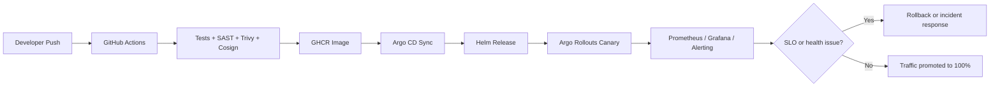

# Payday Fintech

A secure, automated, and observable Kubernetes delivery platform for Payday's payments API. The repository combines Terraform, GitHub Actions, ArgoCD, Argo Rollouts, Helm-based deployments, and a Helm-managed observability stack.

## Overview

This repo provides a GitOps-style delivery path for the backend and frontend applications that power Payday. The current implementation includes:

- GitHub Actions CI/CD for backend and frontend image build, test, scan, sign, and promotion
- ArgoCD application sync for production and staging GitOps workflows
- Argo Rollouts canary deployments for safe promotion and rollback
- Helm charts for backend and frontend deployments
- Bitnami PostgreSQL referenced by the backend Helm chart
- EKS node group configuration using `t3a.medium` Spot capacity
- Prometheus scrape annotations and an observability values placeholder for Helm-based monitoring and alerting

## Architecture

The platform follows a code-to-cluster flow:

1. Developer pushes code to `main` or `develop`
2. GitHub Actions builds and tests the backend or frontend
3. Images are pushed to GHCR and signed with Cosign
4. GitHub Actions updates the Helm values and triggers Argo CD sync
5. ArgoCD reconciles the cluster state
6. Argo Rollouts performs canary promotion and rollback
7. Prometheus, Grafana, and alerting monitor health, capacity, and release quality



## Current implementation map

- GitHub Actions:
  - `.github/workflows/backend_pipeline_cd.yml`
  - `.github/workflows/frontend_pipeline_cd.yml`
- GitOps applications:
  - `k8s/argocd-payday-api.yaml`
  - `k8s/argocd-payday-app.yaml`
- Helm charts:
  - `k8s/helm/payday-api`
  - `k8s/helm/payday-app`
- Terraform:
  - `terraform/eks.tf`
  - `terraform/main.tf`
  - `terraform/vpc.tf`
- Observability inputs:
  - `observability/prometheus-values.yaml`

## CI/CD

The GitHub Actions workflows run on push and pull request events for the backend and frontend folders.

### Backend workflow

The backend workflow:

- installs Python dependencies
- runs linting and unit tests
- generates coverage output
- scans the image with Trivy
- signs the image with Cosign
- deploys to staging on `develop`
- promotes to production on `main`
- waits for Argo CD health and monitors Argo Rollouts canary status

### Frontend workflow

The frontend workflow:

- installs Node dependencies
- runs tests and lint
- builds a production Docker image
- scans the image with Trivy
- signs the image with Cosign
- updates GitOps Helm values for staging or production
- syncs ArgoCD
- monitors rollout status using Argo Rollouts

## ArgoCD and Argo Rollouts

ArgoCD is the GitOps controller that reconciles the Helm charts into the cluster. The current application manifests live in:

- `k8s/argocd-payday-api.yaml`
- `k8s/argocd-payday-app.yaml`

Argo Rollouts is used directly in the Helm templates, where both `payday-api` and `payday-app` are rendered as `Rollout` resources with a canary strategy. This enables phased promotion and rollback without replacing the application manifests.

## Observability and alerting

Observability is designed to be Helm-based and aligned with the existing app-level scrape annotations.

### Current status

- Backend Helm values expose Prometheus scrape metadata for `/metrics`
- `observability/prometheus-values.yaml` exists as the Helm values placeholder for Prometheus configuration
- Grafana and alerting are expected to be installed through Helm values and referenced by the runbook and architecture docs

### Operational intent

- Prometheus scrapes application and cluster targets
- Grafana provides dashboards visualization for the #4GoldenSignals; Latency, Throughputs, Error rates and Saturations
- Alerting is used to notify on degraded health, failed rollouts, database issues, and workload saturation through slack or AWS SNS

## PostgreSQL

The backend Helm chart references a Bitnami PostgreSQL service named `postgres-postgresql` in the `payday` namespace.

Current backend values reference:

- `DB_HOST=postgres-postgresql.payday.svc.cluster.local`
- `DB_PORT=5432`
- `DB_NAME=payday_db`
- `DB_USER=payday`

This repo expects the Bitnami PostgreSQL chart to be installed separately and exposed to the backend through the service name above.

## EKS and Spot capacity

The Terraform EKS module in `terraform/eks.tf` uses a managed node group with the following settings:

- `instance_types = ["t3a.medium"]`
- `capacity_type = "SPOT"`
- `min_size = 2`
- `max_size = 6`
- `desired_size = 5`

This is the current production target footprint for the EKS worker pool. Because Spot capacity can be interrupted, the operational runbook should treat it as ephemeral capacity and favor graceful rollbacks, fast rescheduling, and reactive scaling.

## Repository layout

```text
.
├── .github/workflows/          # CI/CD workflows
├── docs/                       # Architecture, runbooks, and cost analysis
├── k8s/                        # Argo CD manifests and Helm charts
├── observability/              # Helm values and monitoring artifacts
├── payday-devops/app           # Backend and frontend source code
├── terraform/                  # EKS and networking infrastructure
└── README.md
```

## Documentation

- Architecture guide: `docs/architecture.md`
- Operational runbook: `docs/runbook.md`
- Cost analysis: `docs/cost-analysis.md`

## Recommended deployment flow

1. Provision infra with Terraform
2. Install Argo CD and the required Helm repositories
3. Install the Bitnami PostgreSQL release
4. Install Prometheus, Grafana, and alerting via Helm
5. Apply the Argo CD application manifests
6. Confirm deployments and rollout health

## Quick references

- Terraform: `terraform init`, `terraform plan`, `terraform apply`
- ArgoCD sync: `argocd app sync payday-api` and `argocd app sync payday-app`
- Rollout inspection: `kubectl argo rollouts get rollout payday-api -n payday`
- Rollback: `kubectl argo rollouts abort payday-api -n payday`

---

This README is intended to be the entry point for the repo; the detailed operating procedures now live in the `docs/` directory.
