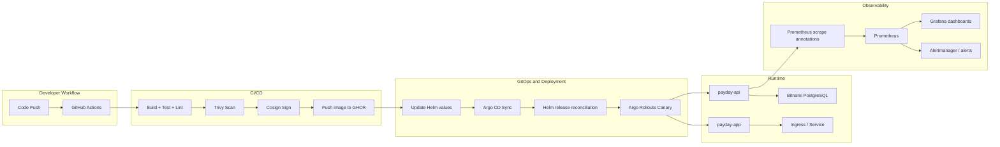

# Architecture

This document summarizes the current Payday platform architecture, the runtime topology, and the key integration points between GitHub Actions, Argo CD, Argo Rollouts, Helm, and observability.

## High-level architecture

## Components

### Source and CI/CD

- Backend source: `payday-devops/app/backend`
- Frontend source: `payday-devops/app/frontend`
- GitHub Actions workflows:
  - `.github/workflows/backend_pipeline_cd.yml`
  - `.github/workflows/frontend_pipeline_cd.yml`

The pipelines perform linting, unit tests, container builds, Trivy scans, Cosign signing, and promotion to staging or production.

### GitOps and deployment

- Argo CD applications:
  - `k8s/argocd-payday-api.yaml`
  - `k8s/argocd-payday-app.yaml`
- Helm charts:
  - `k8s/helm/payday-api`
  - `k8s/helm/payday-app`

Both charts render `Rollout` objects instead of standard `Deployment` objects, which gives the release flow access to Argo Rollouts canary controls.

### Infrastructure

- Terraform infrastructure is defined under `terraform/`
- EKS is provisioned via the Terraform AWS EKS module
- The managed node group uses `t3a.medium` Spot instances

### State and data

- Backend expects a Bitnami PostgreSQL release named `postgres-postgresql`
- The service is referenced by the chart values in `k8s/helm/payday-api/values.yaml`

### Observability

- Prometheus is wired through Helm values in `observability/prometheus-values.yaml`
- Backend metrics are exposed using Prometheus annotations in the Helm values
- Grafana and alerting should be deployed through Helm and connected to the Prometheus endpoints

## Deployment flow

1. Code is merged into `develop` or `main`
2. GitHub Actions builds and validates the affected service
3. The workflow updates Helm image tags and commits the GitOps values change
4. Argo CD reconciles the cluster state
5. Argo Rollouts applies the canary strategy
6. Prometheus and Grafana monitor rollout health and service behavior

## Runtime responsibilities

### Backend

- Exposes HTTP endpoints for transactions, analytics, merchant data, and webhooks
- Reads configuration from environment variables
- Connects to PostgreSQL using the `postgres-postgresql` service
- Exposes metrics at `/metrics`

### Frontend

- Serves the user interface via the `payday-app` workload
- Uses the backend service as the upstream application API

## Networking and access

The Helm charts include service and ingress templates; the current implementation enables the service and rollout logic, while ingress settings can be expanded as needed. The exact ingress controller and gateway integration should be documented in the environment-specific values.

## Operational assumptions

- The `payday` namespace is the target namespace for workloads
- Argo CD auto-sync and self-heal are enabled
- Spot capacity is treated as variable capacity and requires alerting and operational readiness
- The observability values file is the place to centralize Helm-based monitoring configuration

## Recommended improvement areas

- Populate `observability/prometheus-values.yaml` with the actual Prometheus, Grafana, and Alertmanager Helm values
- Add explicit Grafana dashboard and alert rules for rollout and database health
- Add PodDisruptionBudgets and node affinity rules for Spot resilience
- Add a dedicated `values-production.yaml` and `values-staging.yaml` strategy for environment-specific monitoring
